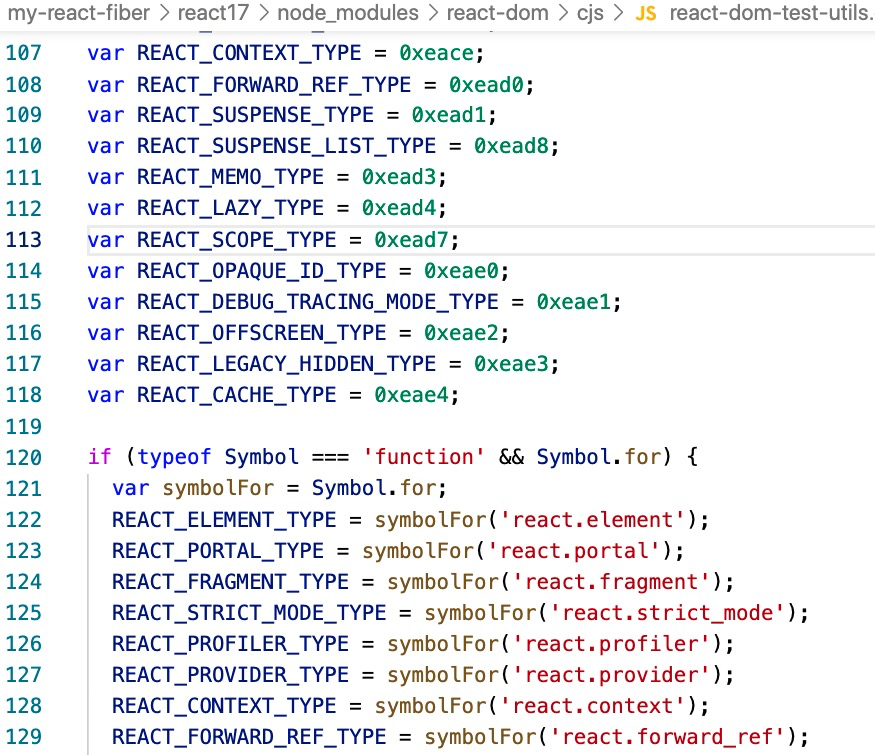
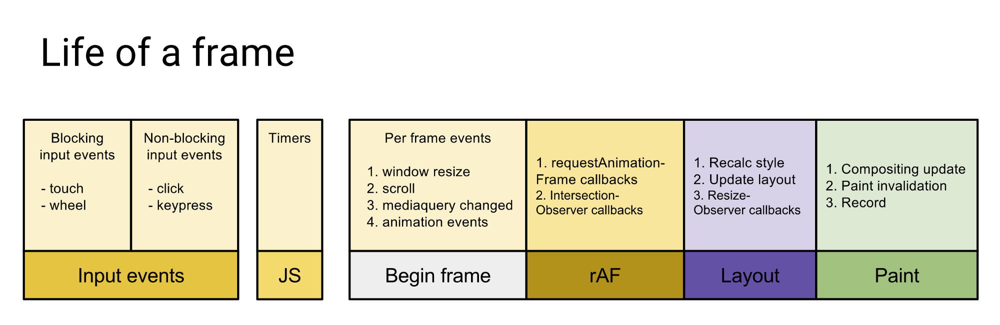

<!-- START doctoc generated TOC please keep comment here to allow auto update -->
<!-- DON'T EDIT THIS SECTION, INSTEAD RE-RUN doctoc TO UPDATE -->
**Table of Contents**  *generated with [DocToc](https://github.com/thlorenz/doctoc)*

- [react-Fiber 深入浅出](#react-fiber-%E6%B7%B1%E5%85%A5%E6%B5%85%E5%87%BA)
  - [react更新界面的基本流程](#react%E6%9B%B4%E6%96%B0%E7%95%8C%E9%9D%A2%E7%9A%84%E5%9F%BA%E6%9C%AC%E6%B5%81%E7%A8%8B)
- [jsx 本质](#jsx-%E6%9C%AC%E8%B4%A8)
  - [react的状态更新，及存在的问题](#react%E7%9A%84%E7%8A%B6%E6%80%81%E6%9B%B4%E6%96%B0%E5%8F%8A%E5%AD%98%E5%9C%A8%E7%9A%84%E9%97%AE%E9%A2%98)
  - [简化任务，提出解决方案,时间片requestIdleCallback](#%E7%AE%80%E5%8C%96%E4%BB%BB%E5%8A%A1%E6%8F%90%E5%87%BA%E8%A7%A3%E5%86%B3%E6%96%B9%E6%A1%88%E6%97%B6%E9%97%B4%E7%89%87requestidlecallback)
    - [react 构建元素](#react-%E6%9E%84%E5%BB%BA%E5%85%83%E7%B4%A0)

<!-- END doctoc generated TOC please keep comment here to allow auto update -->


## 深入浅出 React Fiber 


#### react更新界面的基本流程

1. react任务调度，执行component.render方法或执行functionComponent函数，得到新的虚拟节点数据
2. 用当前【新的虚拟节点数据】和【之前的旧虚拟节点数据】对比，得到真正需要更新（增、删、改）的dom节点（俗称Reconciliation/调和阶段）
3. 操作真实dom,更新界面。（俗称commit/提交阶段）


#### 获取虚拟节点的过程，

解析JSX,得到reactElement数据,JSX是什么？reactElement是什么？

babel在线地址: https://www.babeljs.cn/repl

```jsx
<div id="top-1">
    I  am textNode
    <h2>hello world</h2>
    <ul>
        <li>我是1</li>
        <li>我是2</li>
        <li>我是3</li>
        <li>我是4</li>
    </ul>
</div>

let React = {createElement};
//返回reactElement，可认为是虚拟节点

"use strict";
/*#__PURE__*/
let myReactElment = React.createElement("div", {
  id: "top-1"
}, "I  am textNode", /*#__PURE__*/React.createElement("h2", null, "hello world"), /*#__PURE__*/React.createElement("ul", null, /*#__PURE__*/React.createElement("li", null, "\u6211\u662F1"), /*#__PURE__*/React.createElement("li", null, "\u6211\u662F2"), /*#__PURE__*/React.createElement("li", null, "\u6211\u662F3"), /*#__PURE__*/React.createElement("li", null, "\u6211\u662F4")));

console.log(JSON.stringify(myReactElment));


function createTextVDom(text) {
  return {
    type: 'TEXT',
    props: {
      nodeValue: text,
      children: []
    }
  }
}

function createElement(type, props, ...children) {
  return {
    type,
    props: {
      ...props,
      children: children.map(child => {
        return typeof child === 'object' ? child: createTextVDom(child)
      })
    }
  }
}

//react 内部的数据结构

{"type":"div","props":{"id":"top-1","children":[{"type":"TEXT","props":{"nodeValue":"I  am textNode","children":[]}},{"type":"h2","props":{"children":[{"type":"TEXT","props":{"nodeValue":"hello world","children":[]}}]}},{"type":"ul","props":{"children":[{"type":"li","props":{"children":[{"type":"TEXT","props":{"nodeValue":"我是1","children":[]}}]}},{"type":"li","props":{"children":[{"type":"TEXT","props":{"nodeValue":"我是2","children":[]}}]}},{"type":"li","props":{"children":[{"type":"TEXT","props":{"nodeValue":"我是3","children":[]}}]}},{"type":"li","props":{"children":[{"type":"TEXT","props":{"nodeValue":"我是4","children":[]}}]}}]}}]}}

```

JSX执行结果是，虚拟节点数据，在react里我们称之为ReactElement,ReactElement基本结构如下：

```typescript
    interface ReactElement<P = any, T extends string | JSXElementConstructor<any> = string | JSXElementConstructor<any>> {
        type: T;
        props: P;
        key: Key | null;
    }
```
type是原生节点的名称（字符串），或者自定义组件(class/function)本身,type很重要。

后续构建fiber时还有一个tag的属性，来区分时哪种组件的,区分类型的，后面会用到。


type 是通过jsx解析得来值，tag是根据类型判断后赋值得到的。


#### react的更新流程哪里可能会出现问题

1？2？3？

初始化(更新)state==>执行render()===>得到虚拟dom(reactElement)===》对比新旧dom节点===>对真实dom 做相应的的【增删改】
当项目存在大量节点时，对比新旧dom节点的必然消耗大量时间，当时间超过一定阈值时，带来浏览器掉帧，可能会出现页面卡顿现象。

何为掉帧？为什么会造成掉帧？
浏览器能看到内容发生变化，和动画一个原理，本质上是由一帧一帧的图像构成的，当有新的图片不断连续覆盖旧的图片。

有 Web 动画那么就会存在该动画在播放运行时的帧率。而帧率在不同设备不同情况下又是不一样的。

认识下 requestAnimationFrame  下一帧执行时，都会执行下，参数里的回调

```javascript
//获取chrome的帧频

getChromeFps();

function getChromeFps(){ 
    let offset,step; 
    let fps = 0; 
    let startTime = performance.now(); 
    const executeOneFrame = ()=>{
        //每次更新1帧
        fps += 1;
        if( performance.now() - startTime >= 1000 ){ 
            console.log(`fps=${fps}`);
            return;
        }else{
            requestAnimationFrame(executeOneFrame); 
        }
    }
    requestAnimationFrame( executeOneFrame ); 
};
    
```
FPS（frame per second）是浏览器每秒刷新的次数

理论上说，FPS 越高，动画会越流畅，目前大多数设备的屏幕刷新率为 60 次/秒，所以通常来讲 FPS 为 60 frame/s 时动画效果最好，也就是每帧的消耗时间为 16.67ms。
因为浏览器单线程的设计，当JS执行某项任务超过16.67ms时，由于当前任务未完成，界面无法刷新，必然造成掉帧，或卡死情况。

当React项目里有大量节点或组件时，在协调（调和）阶段有可能造成掉帧问题

#### demo,示例演示，掉帧情况是什么
    -----


### 简化任务，提出解决方案

    1、压缩执行时间？
    2、时间分片。将任务拆分，在每一帧空闲时执行

认识下 requestIdleCallback

浏览器一帧需要处理的内容


每一帧可能有剩余的空闲时间


requestIdleCallback是浏览器提供的API，参数是一个回调函数，当下一帧浏览器有空闲了，执行该回调。

window.requestIdleCallback(callback[, options])


```typescript


    interface IdleRequestCallback {
        (deadline: IdleDeadline): void;
    }

    interface IdleDeadline {
        readonly didTimeout: boolean;
        timeRemaining(): DOMHighResTimeStamp;
    }

    interface IdleRequestOptions {
        timeout?: number;
    }

    requestIdleCallback(callback: IdleRequestCallback, options?: IdleRequestOptions): number;

```

#### react 构建元素

https://btraljic.github.io/sync-async-debounced/


