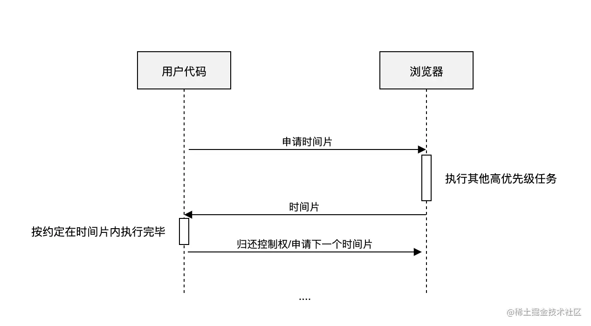
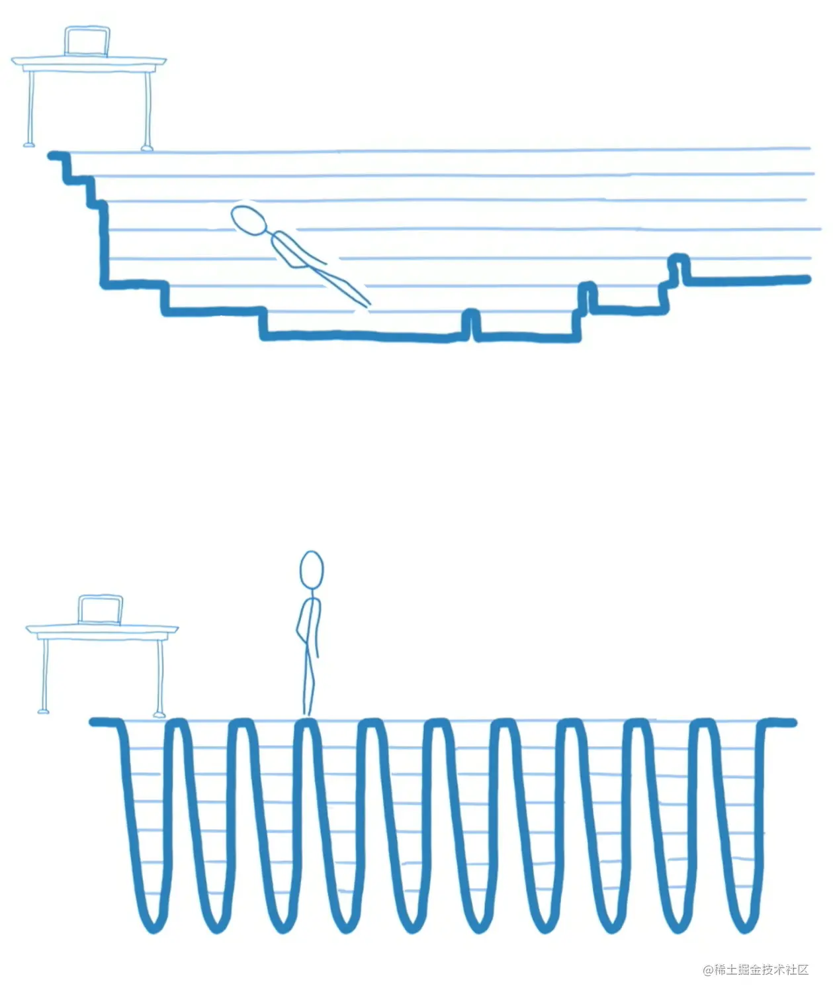

<!-- START doctoc generated TOC please keep comment here to allow auto update -->
<!-- DON'T EDIT THIS SECTION, INSTEAD RE-RUN doctoc TO UPDATE -->
**Table of Contents**  *generated with [DocToc](https://github.com/thlorenz/doctoc)*

- [react-Fiber 深入浅出](#react-fiber-%E6%B7%B1%E5%85%A5%E6%B5%85%E5%87%BA)
  - [react更新界面的基本流程](#react%E6%9B%B4%E6%96%B0%E7%95%8C%E9%9D%A2%E7%9A%84%E5%9F%BA%E6%9C%AC%E6%B5%81%E7%A8%8B)
- [jsx 本质](#jsx-%E6%9C%AC%E8%B4%A8)
  - [react的状态更新，及存在的问题](#react%E7%9A%84%E7%8A%B6%E6%80%81%E6%9B%B4%E6%96%B0%E5%8F%8A%E5%AD%98%E5%9C%A8%E7%9A%84%E9%97%AE%E9%A2%98)
  - [简化任务，提出解决方案,时间片requestIdleCallback](#%E7%AE%80%E5%8C%96%E4%BB%BB%E5%8A%A1%E6%8F%90%E5%87%BA%E8%A7%A3%E5%86%B3%E6%96%B9%E6%A1%88%E6%97%B6%E9%97%B4%E7%89%87requestidlecallback)
    - [react 构建元素](#react-%E6%9E%84%E5%BB%BA%E5%85%83%E7%B4%A0)

<!-- END doctoc generated TOC please keep comment here to allow auto update -->


## 深入浅出 React Fiber 


#### react更新界面的基本流程

1. react任务调度，执行component.render方法或执行functionComponent函数，得到新的虚拟节点数据
2. 用当前【新的虚拟节点数据】和【之前的旧虚拟节点数据】对比，得到真正需要更新（增、删、改）的dom节点（俗称Reconciliation/调和阶段）
3. 操作真实dom,更新界面。（俗称commit/提交阶段）


#### 获取虚拟节点的过程，

解析JSX,得到reactElement数据,JSX是什么？reactElement是什么？

babel在线地址: https://www.babeljs.cn/repl

```jsx
<div id="top-1">
    I  am textNode
    <h2>hello world</h2>
    <ul>
        <li>我是1</li>
        <li>我是2</li>
        <li>我是3</li>
        <li>我是4</li>
    </ul>
</div>

let React = {createElement};
//返回reactElement，可认为是虚拟节点

"use strict";
/*#__PURE__*/
let myReactElment = React.createElement("div", {
  id: "top-1"
}, "I  am textNode", /*#__PURE__*/React.createElement("h2", null, "hello world"), /*#__PURE__*/React.createElement("ul", null, /*#__PURE__*/React.createElement("li", null, "\u6211\u662F1"), /*#__PURE__*/React.createElement("li", null, "\u6211\u662F2"), /*#__PURE__*/React.createElement("li", null, "\u6211\u662F3"), /*#__PURE__*/React.createElement("li", null, "\u6211\u662F4")));

console.log(JSON.stringify(myReactElment));


function createTextVDom(text) {
  return {
    type: 'TEXT',
    props: {
      nodeValue: text,
      children: []
    }
  }
}

function createElement(type, props, ...children) {
  return {
    type,
    props: {
      ...props,
      children: children.map(child => {
        return typeof child === 'object' ? child: createTextVDom(child)
      })
    }
  }
}

//react 内部的数据结构

{"type":"div","props":{"id":"top-1","children":[{"type":"TEXT","props":{"nodeValue":"I  am textNode","children":[]}},{"type":"h2","props":{"children":[{"type":"TEXT","props":{"nodeValue":"hello world","children":[]}}]}},{"type":"ul","props":{"children":[{"type":"li","props":{"children":[{"type":"TEXT","props":{"nodeValue":"我是1","children":[]}}]}},{"type":"li","props":{"children":[{"type":"TEXT","props":{"nodeValue":"我是2","children":[]}}]}},{"type":"li","props":{"children":[{"type":"TEXT","props":{"nodeValue":"我是3","children":[]}}]}},{"type":"li","props":{"children":[{"type":"TEXT","props":{"nodeValue":"我是4","children":[]}}]}}]}}]}}

```

JSX执行结果是，虚拟节点数据，在react里我们称之为ReactElement,ReactElement基本结构如下：

```typescript
    interface ReactElement<P = any, T extends string | JSXElementConstructor<any> = string | JSXElementConstructor<any>> {
        type: T;
        props: P;
        key: Key | null;
    }
```
type是原生节点的名称（字符串），或者自定义组件(class/function)本身,type很重要。

后续构建fiber时还有一个tag的属性，来区分时哪种组件的,区分类型的，后面会用到。


type 是通过jsx解析得来值，tag是根据类型判断后赋值得到的。


#### react的更新流程哪里可能会出现问题

1？2？3？

初始化(更新)state==>执行render()===>得到虚拟dom(reactElement)===》对比新旧dom节点===>对真实dom 做相应的的【增删改】
当项目存在大量节点时，对比新旧dom节点的必然消耗大量时间，当时间超过一定阈值时，带来浏览器掉帧，可能会出现页面卡顿现象。

何为掉帧？为什么会造成掉帧？
浏览器能看到内容发生变化，和动画一个原理，本质上是由一帧一帧的图像构成的，当有新的图片不断连续覆盖旧的图片。

有 Web 动画那么就会存在该动画在播放运行时的帧率。而帧率在不同设备不同情况下又是不一样的。

认识下 requestAnimationFrame  下一帧执行时，都会执行下，参数里的回调

```javascript
//获取chrome的帧频

getChromeFps();

function getChromeFps(){ 
    let offset,step; 
    let fps = 0; 
    let startTime = performance.now(); 
    const executeOneFrame = ()=>{
        //每次更新1帧
        fps += 1;
        if( performance.now() - startTime >= 1000 ){ 
            console.log(`fps=${fps}`);
            return;
        }else{
            requestAnimationFrame(executeOneFrame); 
        }
    }
    requestAnimationFrame( executeOneFrame ); 
};
    
```
FPS（frame per second）是浏览器每秒刷新的次数

理论上说，FPS 越高，动画会越流畅，目前大多数设备的屏幕刷新率为 60 次/秒，所以通常来讲 FPS 为 60 frame/s 时动画效果最好，也就是每帧的消耗时间为 16.67ms。
因为浏览器单线程的设计，当JS执行某项任务超过16.67ms时，由于当前任务未完成，界面无法刷新，必然造成掉帧，或卡死情况。

当React项目里有大量节点或组件时，在协调（调和）阶段有可能造成掉帧问题

#### demo,示例演示，掉帧情况是什么
    -----


### 简化任务，提出解决方案

    1、压缩执行时间？
    2、时间分片。将任务拆分，在每一帧空闲时执行

认识下 requestIdleCallback

浏览器一帧需要处理的内容


每一帧可能有剩余的空闲时间


requestIdleCallback是浏览器提供的API，参数是一个回调函数.
触发时机：当下一帧浏览器有空闲了，执行该回调。
可选option,{timeout:number},当一直没有空闲时，到了超时时间强制执行传入的回调

window.requestIdleCallback(callback[, options])


```typescript


    interface IdleRequestCallback {
        (deadline: IdleDeadline): void;
    }

    interface IdleDeadline {
        readonly didTimeout: boolean;
        timeRemaining(): DOMHighResTimeStamp;
    }

    interface IdleRequestOptions {
        timeout?: number;
    }

    requestIdleCallback(callback: IdleRequestCallback, options?: IdleRequestOptions): number;

```

#### demo,示例演示 requestIdleCallback是界面流畅起来的

    -----

#### react对fiber的实现

1、使用时间分片，重写了requestIdleCallback
2、将虚拟节点树改造成多指针链表
3、将不可中断的递归遍历改成通过while条件控制可中断的遍历

```javascript
// 模拟一下这段代码如何 递归遍历的
<div id="01">
    <h2 id="02">hello world h2</h2>
    <div id="03">
        <p id="04"><span id="05">我是span</span></p>  
     </div>
     <ul id="06">
          <li id="07">我是1</li>
          <li id="08">我是2</li>
      </ul>
      <h3 id="09">hello world h3</h3>
</div>
```
#### 实现一个简单版的深度优先，递归遍历
    
```javascript

let myElementData = {"type":"div","props":{"id":"01","children":[{"type":"h2","props":{"id":"02","children":[{"type":"TEXT","props":{"nodeValue":"hello world h2","children":[]}}]}},{"type":"div","props":{"id":"03","children":[{"type":"p","props":{"id":"04","children":[{"type":"span","props":{"id":"05","children":[{"type":"TEXT","props":{"nodeValue":"我是span","children":[]}}]}}]}}]}},{"type":"ul","props":{"id":"06","children":[{"type":"li","props":{"id":"07","children":[{"type":"TEXT","props":{"nodeValue":"我是1","children":[]}}]}},{"type":"li","props":{"id":"08","children":[{"type":"TEXT","props":{"nodeValue":"我是2","children":[]}}]}}]}},{"type":"h3","props":{"id":"09","children":[{"type":"TEXT","props":{"nodeValue":"hello world h3","children":[]}}]}}]}};

//每个节点 进入时 输出 beginWork , 结束时输出 completeWork
//子节点任务全部完成，容器节点才算完成任务

dfsForElementData(myElementData);

```
这时需要现场找人是现实 dfsForElementData 函数
```javascript
//随机找人代码
(()=>{
    let nameList = ['xiao','ming','dang'];
    let luckyIndex = Math.floor(Math.random()*nameList.length);
    console.log(nameList[luckyIndex]);
})()
```

要求
    1、每个节点进入时输出 ${id}--beginWork,暂停10ms(死循环10ms), 结束时输出${id}，--completeWork. (id不存在的情况用nodeValue替代)
    2、子节点任务全部完成，容器节点才算完成任务

#### 体会递归遍历的缺点
一次性完成，没中断，如果节点很长或节点任务很耗时，将不可避免的阻塞主线程。

可能有的改进方案：

    0、优化算法算法，尽可能的压缩遍历执行时间
    1、web worker  
    2、时间分片，将任务分拆，满足用户体验优先的前提下，合理安排执行顺序

筛选方案理由:

    0、永远不能低估过使用者的想象力，任何情况都不能保证，执行时间能压缩到足够小,方案0舍弃
    1、fiber,虽然在构建或对比过程中，没在【浏览器页面】插入或更新dom节点，但在内存里有处理dom的动作，webWorker 不支持
    2、时间分片，合理安排任务优先级，似乎是不错的选择


#### 实现一个简单版时间分片遍历

```javascript
//随机找人协助实现代码,加深印象
(()=>{
    let nameList = ['xiao','ming','dang'];
    let luckyIndex = Math.floor(Math.random()*nameList.length);
    console.log(nameList[luckyIndex]);
})()
```

通过递归时间分片体会下面2张图的意义：



#### fiber的定义
上文，递归改链表，同步变合作（忙里偷闲）的策略叫做 Cooperative Scheduling（合作式调度）

以下表述来自：https://juejin.cn/post/6844903975112671239

把渲染前的计算过程拆分成多个子任务，每次只做一小部分，做完看是否还有剩余时间，如果有继续下一个任务；如果没有，挂起当前任务，将时间控制权交给主线程，等主线程不忙的时候在继续执行。 这种策略叫做 Cooperative Scheduling（合作式调度），操作系统常用任务调度策略之一。



Cooperative Scheduling的react实现基础就是fiber，fiber在react里是一种架构设计，用来解决界面可能存在的阻塞，任务优先级等问题。

fiber有是一个数据结构，react组件构建的最小单位，其结构如下：

```typescript

type Fiber = {
    //组件/节点 类型
    $$typeof?:Symbol;
    tag:Symbol;

    //string|Function|((props:any)=>any);
    //dom节点string名字， classComponent类  ,functionComponent
    type:any;

    //dom 节点 ，或 class实例或function执行结果
    stateNode:any;

    props:any;
    children?:any[];

    //链接指针
    sibling?:Fiber;
    child?:Fiber;
    return?:Fiber;

    //effect指针
    firstEffect?:Fiber;
    lastEffect?:Fiber;
    nextEffect?:Fiber;
    effectTag?:symbol;

    //组件任务队列
    updateQueue?:any;
    hooks?:any[];

    //新旧互指
    alternate?:Fiber;

}

```

#### fiber构建过程

##### 双缓冲
##### 调和算法
##### commit 

```javascript
//专业术语对照
let nextUnitOfWork = null; 
let workInProgressRoot = null;
let workInProgressFiber = null; 
let currentRoot = null; 
let deletions = []; 
```


参考版权


    


    


#### 真实 react 版演示 16.8.3
https://btraljic.github.io/sync-async-debounced/


